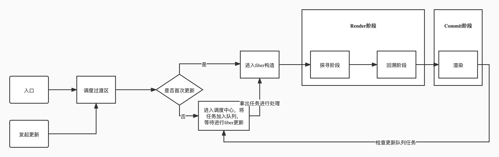

1. ## 整体流程 
  

2. ## 基础概念
   1. Fiber结构
      - HostRootFiber(根Fiber) 
   2. FiberRoot
3. ## Render阶段
   1. ### beginwork
      - #### reconcileChildren函数（）
    2. ### completeWork 
4. ## Commit阶段
   1. beforeMutation
   2. mutation
   3. afterMutation
5. ## 调度中心(Scheduler)
6. ## Hooks流程
   1. 状态Hook
   2. 副作用Hook
7. ## 优先级模型
8. ## 合成事件