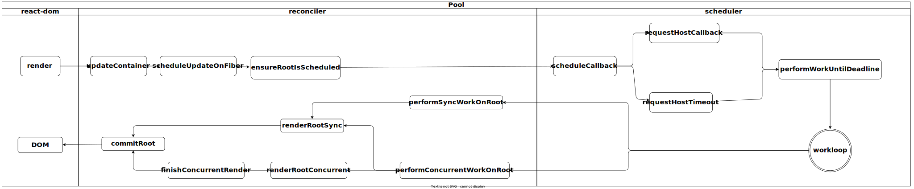

# React Source Code Learn(under construction)
> This project is just the record of my learning load on React source code, new files of 17.0.2 version.

> Reference articles:  
>[图解 React 源码系列](https://7kms.github.io/react-illustration-series/),[React技术揭秘](https://react.iamkasong.com/)
## Brief process 
  

## Basic Concept
   1. Fiber Structure
   2. FiberRoot
## Reconciler
   - ### Render Stage
      1. Beginwork
      2. CompleteWork 
   - ### Commit Stage
      1. BeforeMutation
      2. Mutation
      3. AfterMutation
## Scheduler
## Hooks
>Hooks have been a very important part of react after it was appended into react, and also run very well in our daliy develope tasks. I think we can use it much better if we know the theory of how the hooks work in the process.

   1. [Theory of Hooks](doc/HOOKS/theoryOfHooks.md)
   2. [State Hook](./doc/HOOKS/useState.md)
   3. [Effect Hook](doc/HOOKS/useEffect_useLayoutEffect.md)
## Priority